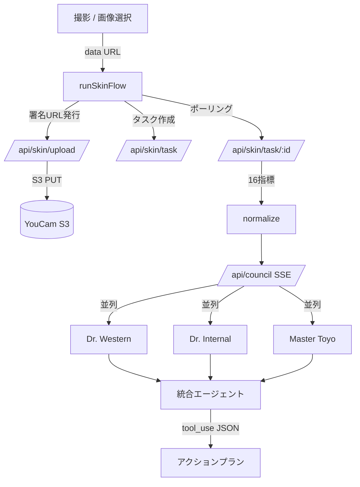

> 本記事は [Zenn Fes Spring 2026 — YouCam API コンテスト](https://zenn.dev/contests/zennfes-spring-2026-perfect) への応募作品です。
> デモ: https://mirror-council.vercel.app/

## TL;DR

- 顔写真から **YouCam Skin Analysis HD API** で 16 指標を取得し、それを **3 体の AI 医師エージェントが「会議」して** 一人ひとりに合わせた肌ケアのアクションプランを返す PWA を作りました。
- エージェントは **Dr. Western(美容皮膚科)/ Dr. Internal(内科)/ Master Toyo(東洋医学)** の 3 視点。最後に**統合エージェント**が議論をまとめます。
- Claude（`claude-sonnet-4-6`）の **3 並列 SSE ストリーミング + tool_use 構造化出力 + Prompt Caching** で実装。
- 一番ハマったのは API でも LLM でもなく **iOS Safari の実機カメラ**でした。その泥臭い解決過程も全部書きます。

---

## なぜ作ったのか — 「スコア」と「私が今日やること」の間にある谷

肌診断アプリは増えました。毛穴 82 点、シワ 80 点……と数値は出る。でも多くの人が本当に知りたいのはそこではなく、

> **「で、私は今日、何をすればいいの？」**

です。さらに言えば、肌の悩みは肌だけの問題ではありません。クマやくすみは睡眠・血流という**全身のサイン**かもしれないし、東洋医学では肌は**五臓の鏡**と捉えます。けれど普通のアプリは「美容皮膚科的な一視点」からしかアドバイスをくれません。

そこで、**1 枚の顔写真を複数の専門家が囲んで議論する**という体験を作ろうと思いました。名前は **トリアージュ（Triage）**。医療で患者の優先度を振り分ける「トリアージ」のように、3 つの視点であなたの肌の**優先課題を振り分ける**、という意味を込めています。

## コンセプト — 3 体の医師 + 1 体の統合役による「鏡の会議」

| エージェント | 役柄 | 見る観点 |
| --- | --- | --- |
| 🔬 **Dr. Western** | 美容皮膚科医 | データドリブン。シワ・毛穴・キメ・ニキビ・ハリ・シミ |
| 🩺 **Dr. Internal** | 内科医 | 全身の健康サイン。クマ・目袋・ツヤ・涙袋から睡眠/血流を推定 |
| 🌿 **Master Toyo** | 東洋医学師 | 五臓と肌の関係。潤い・皮脂・赤み・瞼から食養生・漢方を提案 |
| ⚖️ **統合エージェント** | 司会・編集 | 3 者の意見の重複・対立を整理し、優先度つきプランへ |

同じスコアを見ても、**西洋・内科・東洋でまったく違う読み筋**が出てくる。その「会議」がそのままユーザーへの説得力になります。ビューティ × ヘルスケアの橋渡しを、マルチエージェントという形で表現しました。

## ユーザー体験の流れ

```
撮影 → 観察中（実解析）→ 個別所見（3カード）→ 鏡会議（チャットUI）→ アクションプラン
```

- **ローカルファースト**：サインアップ不要。履歴は `localStorage` に保存。
- **PWA**：ホーム画面に追加すればネイティブアプリのように起動。
- **モバイル前提**：`max-w-md` のスマホ縦持ち UI。

<!-- TODO: ここにスクリーンショット（撮影 / 鏡会議 / プラン）とデモ動画を差し込む -->

## アーキテクチャ



技術スタック：

- **Next.js 16**（App Router）+ React 19 + TypeScript + Tailwind 4 + shadcn/ui
- **Serwist** で PWA（Service Worker）
- **YouCam Skin Analysis HD API**（Perfect Corp）
- **Anthropic Claude `claude-sonnet-4-6`**
- **Vercel** にデプロイ（Hobby プランで動作）

---

## YouCam 連携 — 16 指標を取りに行く

YouCam の Skin Analysis は **S3 への直接アップロード → タスク作成 → ポーリング**の 3 ステップです。API キーはサーバ側（Route Handler）に隠し、ブラウザには署名 URL だけ返します。

```ts
// /api/skin/upload : 署名付きアップロードURLを発行
const resp = await youcamCreateUploadSlot(apiKey, { contentType, fileName, sizeBytes });
// → ブラウザは返ってきた request.url に画像を PUT
```

`dst_actions` に HD 指標を指定すると、`hd_wrinkle` / `hd_pore` / `hd_acne` / `hd_radiance` / `hd_moisture` / `hd_skin_type` …… と **16 種**が返ってきます。これを正規化し、各エージェントが担当する指標へ振り分けます。

### ハマりどころ：YouCam のエラーは「文字列」で返る

タスクが失敗したとき、`data.error` は**オブジェクト（`{ code }`）ではなく文字列**で返ります。

```jsonc
{ "data": { "error": "error_below_min_image_size", "task_status": "error" } }
```

最初これを `error.code` で読もうとして、**あらゆる失敗が `unknown_error` に潰れて**原因が分からなくなりました。文字列として直接拾い、生エラーをサーバログに残すようにして解決。失敗を必ず可観測にしておくのは大事です。

---

## Claude の「会議」をどう実装したか

### 3 賢者を並列で走らせ、SSE で逐次表示する

3 体のエージェントは独立した観点なので、**並列実行**して結果を **Server-Sent Events** でストリーミングします。ユーザーには「医師が一人ずつ喋り出す」ように見えます。

```ts
await Promise.all(SAGES.map(async (role) => {
  write(`${role}_start`, {});
  for await (const evt of runSage(client, role, results, signal)) {
    if (evt.type === "delta") write(`${role}_delta`, { text: evt.text });
    else write(`${role}_done`, { text: evt.result.text, usage: ... });
  }
}));
// 3者の所見がそろってから統合エージェントを起動
```

### 統合は tool_use で構造化出力に固定する

統合エージェントの出力は UI がそのまま使えるよう、`emit_council_summary` という **tool_use**（function calling）で **JSON スキーマに固定**しています。`summary` / `actions[]`（優先度・時間軸・誰の提案か）/ `tradeoffs[]`（意見の対立とその解決）/ `consult_flag`（受診を勧めるか）という構造です。自由文ではなく構造化することで、「今夜やること / 今週 / 今月」のチェックリスト UI に確実に落とせます。

### Prompt Caching でコストを抑える

3 賢者は**共通の長い system プロンプト**を持つので、ここを **Prompt Caching** に載せます。同一診断の 2 リクエスト目以降、キャッシュが効いているか実測すると：

```
1回目: cache_read=0,      cache_creation=13257   （書き込み）
2回目: cache_read=13257,  cache_creation=793     （ほぼ全ヒット）
```

並列実行の都合上、同一リクエスト内の 3 賢者はキャッシュ書き込みが競合するので**リクエストをまたいで**効きます。それでもキャッシュ生成トークンを 1/16 程度まで圧縮できました。

### 全員失敗してもプランは止めない

3 賢者のうち一部が失敗しても、成功した観点だけで統合に進む**グレースフルデグラデーション**を入れています。全滅したときだけ統合をスキップ。AI を複数並べるなら「誰かがコケる」前提の設計が必要です。

---

## 本当の難所は iOS Safari の実機カメラだった

ローカルとサーバの E2E が通っても、**実機 iPhone で撮ると延々エラー**が出ました。ここが一番学びが多かったので、起きた順に共有します。

### ① `next dev` が起動しない

そもそも開発サーバが落ちる。Next.js 16 はデフォルト Turbopack ですが、`@serwist/next` が webpack 設定を注入するため衝突していました。`next.config.ts` に空の `turbopack: {}` を置いて解消（本番は `next build --webpack`）。

### ② `error_below_min_image_size`：最小サイズは「短辺」に効く

撮影すると解像度不足エラー。サンプルを縮小して二分探索した結果、**ゲートは短辺に効く**と判明しました。

| 画像 | 短辺 | 結果 |
| --- | --- | --- |
| 1451×2242 / 1450×1653 / 2000×3000 | ≥1450 | ✅ |
| 1036×1600 | 1036 | ❌ |
| 800×1000 | 800 | ❌ |

iOS Safari のフロントカメラは `width: { ideal: 1280 }` を**無視して小さいストリームを返す**ことが多い。そこで撮影後に **canvas で短辺 ≥1500px までアップスケール**する安全網を入れました。

### ③ `error_src_face_too_small`：WYSIWYG の崩れ

次は「顔が小さすぎる」。原因は**プレビューと撮影画像のズレ**でした。プレビューは 3:4 の `object-cover` なのに、`snapshot()` は**カメラの全フレーム（横長 1920×1080 等）**を保存していた。だからガイド枠いっぱいに顔を収めても、アップロード画像では顔が小さい比率になっていたのです。

→ 撮影時に**プレビューと同じ 3:4 範囲へクロップ**（`object-cover` 相当の中央クロップ）してから上げるよう修正。「**見たまま＝解析される**」を担保したら通りました。

```ts
// プレビュー(3:4)と同じ範囲を切り出してからアップスケール
const srcAspect = w / h;
if (srcAspect > CAPTURE_ASPECT) {            // 横長 → 左右をクロップ
  cropH = h; cropW = Math.round(h * CAPTURE_ASPECT);
  sx = Math.round((w - cropW) / 2); sy = 0;
} else {                                     // 縦長 → 上下をクロップ
  cropW = w; cropH = Math.round(w / CAPTURE_ASPECT);
  sx = 0; sy = Math.round((h - cropH) / 2);
}
```

### 学び

実機で初めて出るバグは、たいてい**「画面で見えているもの」と「実際に送っているデータ」のズレ**から来ます。カメラ系は特に、`videoWidth/Height`・`object-cover`・センサーの向きが三つ巴でズレるので、**WYSIWYG を疑う**のが近道でした。

---

## 医療ではない、という線引き

肌は健康のサインを映しますが、本サービスは**医療行為ではありません**。表示されるのは一般的な情報の整理であり、診断・治療の代替にはなりません。統合エージェントには受診を促す `consult_flag` を持たせ、気になる症状があれば医療機関へ、と明示しています。AI に「医師」を演じさせるからこそ、ここは強めに線を引いています。

## おわりに

「スコアを出す」ところで止まりがちな肌診断に、**複数の専門家が議論する**という一手間を足すだけで、体験が「健康診断の結果票」から「相談」に変わりました。YouCam の確かな解析と Claude のマルチエージェントは相性が良いです。

- 🪞 デモ: https://mirror-council.vercel.app/
- 使用 API: YouCam Skin Analysis HD / Anthropic Claude `claude-sonnet-4-6`

<!-- TODO: スクリーンショット・デモ動画・(公開するなら)リポジトリリンクを追加 -->
<!-- TODO: 公開前に published: true に変更し、記事ページから「コンテストに応募」ボタンを押す -->
